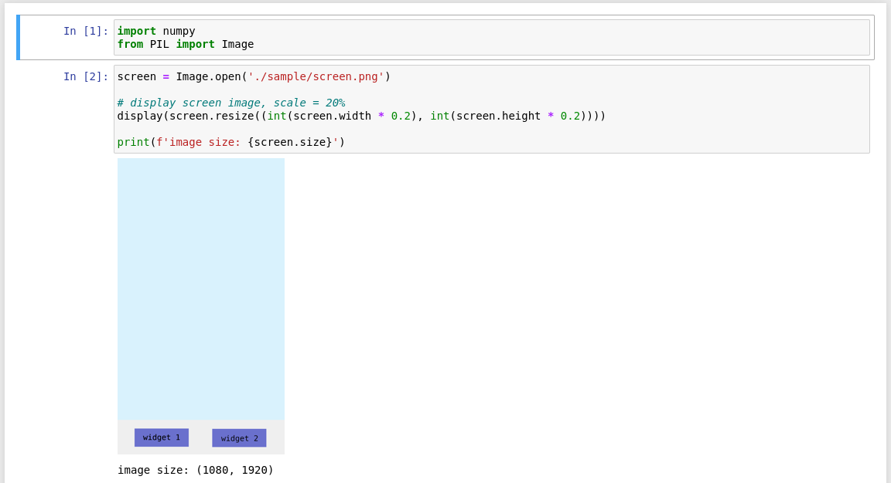
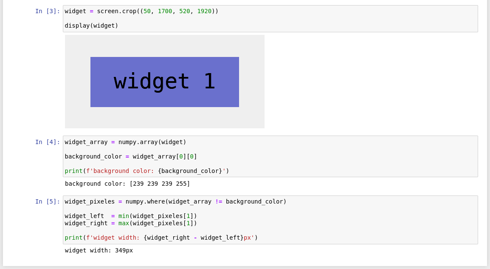

[](https://github.com/prettier/prettier)

# Jupyter Notebook Examples

# Table of contents

* [Overview](#overview)
* [Get started](#get-started)
  * [Requirements](#requirements)
  * [Run example](#run-example)
    * [Installation](#installation)
    * [Start jupyter](#start-jupyter)
* [Examples](#examples)
* [Additionals](#additionals)
  * [Change Jupyter theme](#change-jupyter-theme)
    * [Get available themes](#get-available-themes)
    * [Install theme](#install-theme)
* [License](#license)

# Overview

The Jupyter Notebook is the original web application for creating and sharing computational documents that enables users
to author notebook documents that include: Live code, Interactive widgets, Plots, Narrative text, Equations, Images,
Video.

# Get Started

## Requirements

- Python +3.6

## Run example

### Installation

1. Move to example directory ([examples/widget_width](examples/widget_width))

    ```bash
    cd examples/widget_width/
    ```

2. [`optional but recommended`] Create and activate virtual environment:

    ```bash
    # create virtual environment
    python3 -m venv .venv

    # activate virtual environment
    source .venv/bin/activate
    ```

3. install example requirements:

    ```bash
    pip install -r requirements.txt
    ```

### Start jupyter

```bash
jupyter notebook --no-browser
```




# Examples

- [examples/widget_width](examples/widget_width): example to calculate widget width from an image using Pillow and Numpy.
- [examples/python_exercises.ipynb](examples/python_exercises.ipynb): basic python exercises.

# Additionals

## Change Jupyter theme

### Get available themes

```bash
jt -l
```

### Install theme

```bash
jt -t <THEME>
```

# License

[MIT](./LICENSE)
